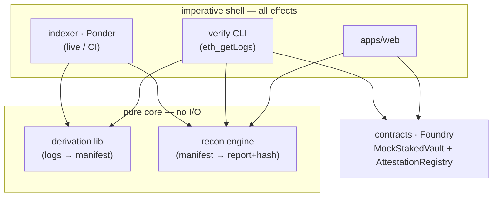
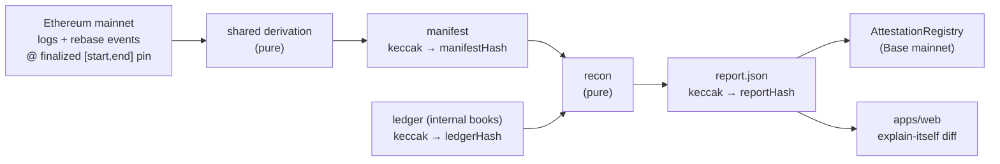

# Architecture Spine — tieout

The one non-negotiable this spine exists to protect (**NFR-0**): **`tieout verify` re-derives the reconciliation from public chain data and reproduces the same hash on two independent machines.** Every invariant below is downstream of that — and because a *second, independent* implementation is invited to verify, the byte-level contract must be pinned, not left to implementer taste.

## Design Paradigm

**Functional core / imperative shell** (ports-and-adapters at the seam). The core is a pure, deterministic computation with zero ambient dependencies; the shell holds every effect. This maps directly onto the packages:

| Layer | Package(s) | Responsibility |
| --- | --- | --- |
| **Pure core** | `packages/recon` (engine + the shared `derivation` lib) | logs → manifest → report + hash. No I/O, clock, network, float, config, or address lookups. |
| **Imperative shell** | `packages/indexer` (Ponder), the `verify` CLI, `apps/web` | RPC, log fetch, address resolution, file/DB writes, attestation submission. |
| **On-chain** | `packages/contracts` (Foundry) | `MockStakedVault` (ERC-4626 test surface) + `AttestationRegistry`. |

The core signature `(manifest, ledger) → (report, reportHash)` **folds** the brief's `(events, rateCurve, ledger, [startBlock, endBlock])`: the manifest bundles events + rate curve + pinned range + address table + `engineVersion` (AD-7). Dependency direction — **shell → core only; the core imports nothing from the shell; `contracts` is standalone (consumed by shell + tests):**



## Invariants & Rules

Stable ascending IDs; never renumbered or reused. These rules are deliberately byte-precise: under NFR-0 a rule that two compliant builds could read two ways is a defect.

### AD-1 — Deterministic pure core
- **Binds:** `recon`, `derivation`, `verify`
- **Prevents:** nondeterminism leaking into the hash; "works on my machine" drift
- **Rule:** `recon` is a pure function `(manifest, ledger) → (report, reportHash)`. No I/O, network, wall-clock, `Date.now()`/`Math.random()`, float, ambient env/config, or address resolution inside the core. Every such effect lives in the shell.

### AD-2 — Integer math, fully specified
- **Binds:** `recon`, `derivation`
- **Prevents:** IEEE-754 drift; association/rounding divergence between two compliant builds
- **Rule:** all canonical quantities are non-negative `bigint` (wei, shares; rates 1e18 fixed-point). Every derived quantity is **multiply-before-divide with exactly one division**, using `bigint /` (truncates toward zero; equals floor here because operands are non-negative). No float ever touches the canonical path — RPC hex is parsed straight to `bigint`, never via `Number`/`parseFloat`. Signed values (e.g. a book-vs-chain delta) are formed by subtraction only and are never a dividend or divisor. Client-library returns that arrive as JS `number` (e.g. viem's `chainId` or transaction counts) are converted to `bigint` at the shell boundary before entering the canonical path. Price/oracle observations carry their feed-native decimals (e.g. Chainlink USD feeds = 8 dp) and are normalized explicitly per AD-18 — never assumed to be 1e18.

### AD-3 — Finalized pin, both endpoints
- **Binds:** all canonical runs (shell + verify)
- **Prevents:** reorg drift; `latest` nondeterminism; two builds choosing different window starts
- **Rule:** a canonical run pins **both** endpoints as concrete `(blockNumber, blockHash)` — `start` and `end` — captured at build time. The range is **closed `[startBlock, endBlock]`** (both inclusive, matching `eth_getLogs`). `latest` is never read; `start` is recorded, never re-derived (not by timestamp, not by block count). `verify` uses the exact recorded pins.

### AD-4 — Total event ordering + dedup
- **Binds:** manifest construction (`derivation`)
- **Prevents:** ordering-dependent hash divergence; duplicate/reorg logs
- **Rule:** events are totally ordered by `(blockNumber, txIndex, logIndex)`, unique per event; that triple is also the dedup key. Only logs from the pinned finalized range are included (no `removed`/reorg logs occur under finality).

### AD-5 — Verified address table
- **Binds:** shell address resolution, canonical serialization
- **Prevents:** wrong/typo'd or memory-sourced addresses; checksum-casing hash splits
- **Rule:** every address comes from a versioned, `cast`-checked table keyed by `chainId`, stored on the canonical path as **lowercase, `0x`-prefixed, fixed-width** hex (EIP-55 checksum is display-only). The table has a deterministic order (by `chainId`, then address). Never hardcoded inline or transcribed from memory. The build-time round-trip check uses viem `getAddress` (a throw is a check failure; the EIP-1191 `chainId` parameter is never passed; any `isAddress` pre-check uses `{ strict: false }`); `cast` remains the human-side spot-check at seed time.

### AD-6 — Canonical rate curve = event-derived
- **Binds:** `derivation` rate input, `verify`
- **Prevents:** the verifier needing an archive node; divergent authoritative rate sources; boundary/rounding false-failures
- **Rule:** the authoritative rate curve is a step function derived from Lido `TokenRebased` fields — stETH-per-wstETH (1e18) = `postTotalEther * 1e18 / postTotalShares` at each rebase. The rate in effect at a position `p = (block, txIndex, logIndex)` is the value from the most recent rebase with position `≤ p`; the curve is seeded from the last rebase at or before `startBlock`. The archive cross-check (`wstETH.stEthPerToken()`; mock `convertToAssets(1e18)`) is read **at rebase blocks, post-report state**, and asserted **exactly equal** to the event-derived value there; between rebases the archive read may drift by share-mint rounding and is not equality-checked.

### AD-7 — The manifest is the boundary contract (fixed schema)
- **Binds:** the recon/shell seam
- **Prevents:** the core reaching for I/O; two builds passing incompatible input shapes
- **Rule:** the sole core input is the canonical **manifest** plus the `ledger`. The manifest has a fixed schema: (a) the pinned `(startBlock, startHash, endBlock, endHash)`; (b) an ordered list of normalized `Event` records — `{type, address, blockNumber, txIndex, logIndex, blockHash, …event-specific fields}`; (c) the rate curve as an ordered list of `(rebaseBlock, rate1e18)` points; (d) the `chainId` address table; (e) `engineVersion`; (f) the pinned **price observation(s)** for fiat valuation (AD-18) — `{feedAddress, roundId, answer, decimals, observedBlock}`, one per valued asset. The field set and every array's order are declared here, not chosen per implementation.

### AD-8 — Strong verify by re-derivation
- **Binds:** `verify`
- **Prevents:** trusting a shipped manifest (re-introducing the custodial trust); silent version-skew failures
- **Rule:** canonical `tieout verify` reconstructs the manifest from public chain data over the pinned range, confirms `manifestHash`, then runs `recon` and confirms `reportHash`. It first asserts the report's `engineVersion` matches the verifier's and reports a mismatch as a version skew, not a bare hash failure. Re-running the engine on a *shipped* manifest is a non-canonical smoke check only and must never be presented as the trust claim.

### AD-9 — One shared derivation function (incl. normalization)
- **Binds:** `indexer` (Ponder) and the `verify` fetch path
- **Prevents:** byte-divergent manifests from two derivation implementations
- **Rule:** the raw-logs → manifest derivation — **including log normalization** — is a single pure function invoked by both the Ponder live adapter and the `verify` `eth_getLogs` adapter. Never reimplemented or partially duplicated per caller. Its input is a declared normalized `RawLog` record `{address, topics, data, blockNumber, txIndex, logIndex, blockHash}` with a documented assembly mapping per adapter — Ponder's `event.log` carries only `{address, topics, data, logIndex}`, so block/tx fields are assembled from `event.block`/`event.transaction`, and the Ponder adapter accumulates events until historical sync completes before invoking the whole-range derivation. Both adapters consume one shared address+topic filter definition derived from the AD-5 table — identical normalization over different filter universes still splits the manifest. **Ponder is not on the verify path.**

### AD-10 — Trust-layered, finality-backed cache
- **Binds:** `verify`, proof-bundle export
- **Prevents:** the "heavy indexer" excuse for weak verify; acceptance of doctored fixtures
- **Rule:** inputs are modeled as L0 auditor RPC → L1 raw-response cache (keyed by query params **and block hash**; immutable under finality) → L2 manifest (hashed) → L3 report (hashed). **Entry layer = trust level.** L0 re-fetch is the canonical trustless path (cheap after first fetch). Shipped L1/L2 bundles are conveniences that cannot lower the trust ceiling — blockhash-keying makes a doctored fixture fail against any honest RPC. (MVP requires only the L0 path; see Deferred.)

### AD-11 — Canonical serialization
- **Binds:** every producer of hashed bytes (`recon`, `derivation`, `verify`)
- **Prevents:** cross-machine byte divergence before hashing
- **Rule:** canonical bytes = RFC 8785 (JCS) object-key ordering, UTF-8, **no BOM, no trailing newline** (JCS is single-line), strings NFC-normalized. **Every integer** (wei, shares, rates, `blockNumber`, `chainId`, timestamps, indices) is a decimal string matching `^-?[0-9]+$`, produced solely by `BigInt.prototype.toString(10)` — never a JSON number, never `Number`/`toLocaleString`. **Every hex value** (addresses, tx/block hashes, topics) is lowercase, `0x`-prefixed, fixed-width. JCS sorts object keys but **not arrays**, so every array in the manifest/report/ledger carries a declared total order (AD-4, AD-13). Exactly one named canonicalizer module produces these bytes for all producers; the `report.json` on disk is byte-identical to the hashed bytes.

### AD-12 — keccak256 hashing + input binding
- **Binds:** `recon` output, `AttestationRegistry`
- **Prevents:** hash-scheme mismatch (keccak vs NIST SHA3); outputs unbound from their inputs
- **Rule:** `reportHash = keccak256(canonicalBytes(report))`, `manifestHash = keccak256(canonicalBytes(manifest))`, `ledgerHash = keccak256(canonicalBytes(ledger))` — **Ethereum keccak256 (Keccak padding), not NIST SHA3-256**, over the UTF-8 canonical bytes. The report embeds `manifestHash`, `ledgerHash`, `engineVersion`, and the pinned `(startBlock, startHash, endBlock, endHash)`. The single anchored value is `reportHash`.

### AD-13 — Merkle-shaped report (ZK stays additive)
- **Binds:** report schema
- **Prevents:** hash divergence from unordered collections; a future data-model teardown for ZK
- **Rule:** the report is an **ordered list of per-lot records**, ordered by acquisition `(blockNumber, txIndex, logIndex)` (tiebreak: a deterministic `lotId`); every other collection in the report also declares its order. ZK proof and selective disclosure remain parked (zero MVP code) but must be introducible as an *additive* Merkle commitment over these ordered records — never a reshape.

### AD-14 — Attestation proves timestamp, not correctness or identity
- **Binds:** `AttestationRegistry`, report claims, UI copy
- **Prevents:** over-claiming what the chain proves; forgeable-identity confusion
- **Rule:** `AttestationRegistry.attest(bytes32 reportHash)` is first-write-wins: the first `attest` stores `{uint64 blockNumber, uint64 timestamp}` keyed by `reportHash` and emits `Attested(reportHash, submitter, timestamp)`; a later `attest` of an already-anchored `reportHash` is an **idempotent no-op success** — the original record is never overwritten and the call does **not** revert — so an adversary who front-runs a public `reportHash` cannot permanently block the author from anchoring. It anchors a single `bytes32` and proves only that `reportHash` existed/was committed at/after a block — **never correctness, never author identity** (`submitter`/`msg.sender` is a recorded fact, not a signature over the report). Correctness comes solely from `verify` re-derivation.

### AD-15 — Mock vault: rate event + bare floor formula
- **Binds:** `packages/contracts` (`MockStakedVault`), the deterministic test surface
- **Prevents:** the event-derived curve having nothing to key on; a false AD-6 cross-check
- **Rule:** `MockStakedVault` (ERC-4626) emits an explicit reward/rate-accrual event whenever `totalAssets` grows, and exposes the **bare floor rate** `convertToAssets(1e18) = totalAssets * 1e18 / totalSupply` with **no OpenZeppelin virtual-shares/decimals offset**, so the AD-6 exact-equality cross-check holds.
- **Test-only:** the mock is a controlled test surface and **MUST NOT be deployed to hold real value** — omitting the ERC-4626 virtual-offset (the standard first-depositor inflation-attack mitigation) is safe *only* because it never has real depositors.

### AD-16 — Honesty boundary: derivation, not the books
- **Binds:** report claims, `apps/web` copy, `verify` output
- **Prevents:** over-claiming that a reproduced hash validates the institution's private ledger
- **Rule:** a reproduced hash attests the **onchain-derived position and the commitment to it — never the honesty or completeness of the private books**. Report text, UI, and `verify` output must state this; a green `verify` means "derivation reproduced," not "the books are right."

### AD-17 — Explain-itself narration from real facts only
- **Binds:** the discrepancy diff/narration (`recon` + `apps/web`)
- **Prevents:** a hand-faked headline; narration drifting from the deterministic facts
- **Rule:** the explain-itself narration is generated solely from `recon`'s real diff output (event id, block, delta, cause) via deterministic templating — no hand-authored numbers or causes on the canonical path. Any purely presentational text rendered UI-only is marked non-canonical and excluded from the hash.

### AD-18 — Fiat valuation from a pinned public price observation
- **Binds:** `derivation` (manifest), `recon` (USD figures), `verify`
- **Prevents:** a USD figure breaking NFR-0 (a private, `latest`, or DEX-spot price); cross-decimal rounding divergence
- **Rule:** every USD figure in the report is derived from a **public onchain price feed** (Chainlink-class aggregator; a DEX spot price is disqualified), read at a **specific `roundId` in effect at the finalized `endBlock`** (never `latest`), resolved **phase-aware** — proxy roundIds encode the aggregator `phaseId` and are not monotonic across phases — and captured into the **manifest** as a first-class hashed input `{feedAddress, roundId, answer, decimals, observedBlock}` (AD-7). The shell resolves the round at build time; the pure core only consumes the recorded observation. USD is computed **multiply-before-divide with exactly one final division** (AD-2), normalizing the decimal widths explicitly (shares 18 · rate 1e18 · feed-native, e.g. 8) to a **declared fixed report USD scale**, serialized as a decimal string (AD-11). `verify` re-reads the pinned round from public data and asserts the recorded `answer`. The feed address lives in the AD-5 `cast`-checked table — the MVP feed is Chainlink **stETH/USD** (`0xCfE54B5cD566aB89272946F602D76Ea879CAb4a8`), composing with the stETH-per-wstETH rate curve, and `decimals` is read from the feed and recorded, never assumed; alternate/multi-currency feeds are Deferred.

### AD-19 — Detached off-chain author signature (onchain stays identity-free)
- **Binds:** report envelope, `verify`, `apps/web`; relationship to AD-14
- **Prevents:** conflating author identity with the onchain attest; a signature that mutates canonical bytes; replay onto a different report
- **Rule:** the report carries a detached **EIP-712 signature over `reportHash`** in the report **envelope — outside the canonical hashed bytes** (it signs the hash, so the `report.json` canonical bytes are identical whether signed or not). The signed typed struct binds `{reportHash, subject, startBlock, endBlock, engineVersion, chainId}` under a `Tieout` domain separator (name, version, chainId) so a signature cannot be lifted onto another report. The MVP verifies **EOA signatures via `ecrecover`**, accepting only the canonical low-s (EIP-2) form — enforced by an explicit s-range check in `verify` (signing libraries produce low-s; recovery functions are not assumed to reject high-s); **ERC-1271** (smart-account/Safe) is the additive path (Deferred). `verify` reports signature validity on a **line separate** from hash reproduction: a valid signature adds the signer's **commitment / non-repudiation**, never correctness and never the honesty of the private books (AD-16). The onchain `AttestationRegistry` remains **identity-free** (AD-14 unchanged) — the author signature is never pushed onchain as an identity claim.

### AD-20 — Ledger input schema (fixed)
- **Binds:** the `recon` ledger input, canonical serialization, `ledgerHash`
- **Prevents:** two builds passing incompatible book shapes; an unordered lot list splitting the hash
- **Rule:** the `ledger` has a fixed schema: `{schemaVersion, subject (lowercase address, AD-5), asset, window: {startBlock, endBlock} (equal to the report's pins, AD-3), lots: [ ordered by (acquisitionBlock, lotId) ] each {lotId, acquisitionBlock, shares, costBasisUsd}, bookedReward}`. Every integer is a decimal-string `bigint` (AD-11); `shares` is wstETH wei (18 dp), `bookedReward` is wei of stETH, `costBasisUsd` is the book's acquisition cost at the report's declared USD scale (AD-18). The ledger is canonicalized and `ledgerHash`-bound (AD-11/AD-12). Two axes tie out: **closing shares** (chain `Transfer`-derived balance vs Σ `lots.shares`) and **reward** (chain rate-curve growth vs `bookedReward` — the axis the injected discrepancy breaks); `costBasisUsd` valued against the AD-18 observation yields unrealized P/L.

## Consistency Conventions

| Concern | Convention |
| --- | --- |
| Naming | `packages/{recon,indexer,contracts}` + `apps/web`; one normalized domain `Event` type; address table keyed by `chainId`. |
| IDs & ordering | event id = `(blockNumber, txIndex, logIndex)`; total order + dedup per AD-4; every serialized array declares its order. |
| Numbers & formats | non-negative `bigint` on the canonical path; serialized as decimal strings (AD-11); rates 1e18 fixed-point. |
| Time | all time/height comes from block data, never wall-clock; no clock in the core. |
| Errors | the core returns typed discriminated results and does not throw across the boundary; the shell owns retries, logging, and exit codes. |
| Config | passed as explicit parameters into the core; never read from `env`/globals inside `recon`/`derivation`. |
| Testing | property/fuzz the pure core (Foundry fuzz for `contracts` under a pinned `[fuzz]` config — explicit `runs`, pinned `seed`; property tests for `recon`); a cross-machine `reportHash` determinism check runs in CI; the canonical slice must drive a real discrepancy **and** the AD-6 cross-check — never a happy-path toy. |
| Versioning | `engineVersion` is a semver string, bumped on any change to derivation, canonicalization, or `recon` math — any change that can move the hash. |

## Stack

SEED — pinned and web-verified 2026-07-01; the code owns it thereafter. Point-in-time npm versions drift; the addresses, chain IDs, and event ABI are stable.

| Name | Version |
| --- | --- |
| Node.js | 24 (Active LTS) |
| TypeScript | 6.0.3 |
| Ponder (indexer) | 0.16.6 |
| Hono (required Ponder peer dep — `packages/indexer`) | ≥4.5 |
| viem (RPC · keccak256 · encoding) | 2.54.1 |
| Foundry (forge / anvil) | v1.7.1 (stable / semver channel) |
| Solidity | 0.8.35 |
| Canonical JSON | RFC 8785 (JCS) — library or in-house canonicalizer |
| Data chain | Ethereum mainnet · chainId 1 (wstETH) |
| Anchor chain | Base mainnet · 8453 (demo) · Base Sepolia · 84532 (rehearsal) · Anvil (tests) |

> ⚠ Cold-start check: confirm Solidity 0.8.35 is a real release before pinning it in code — the project's context packs confirm releases only up to 0.8.27. If it is not, pin the newest real 0.8.x and update this row (see epics.md, Pre-Implementation Verification Notes).

## Structural Seed

```text
tieout/
  packages/
    recon/        # pure bigint engine + shared derivation lib + tests (the heart)
    indexer/      # Ponder live adapter → shared derivation (live app + CI runner)
    contracts/    # Foundry: MockStakedVault (ERC-4626) + AttestationRegistry
  apps/
    web/          # minimal UI: live positions (Multicall3 + WebSocket) + the explain-itself diff
  addresses/      # verified, cast-checked address table keyed by chainId
```

**Verified seed addresses** (Ethereum mainnet, confirmed 2026-07-01 — seed for the AD-5 `cast`-checked table; the code owns the live, lowercased copy):

| Token | Address |
| --- | --- |
| wstETH | `0x7f39C581F595B53c5cb19bD0b3f8dA6c935E2Ca0` |
| stETH | `0xae7ab96520DE3A18E5e111B5EaAb095312D7fE84` |

Canonical data flow (build + verify are the same derivation, entered at different cache layers per AD-10):



**Operational envelope:**
- `recon` + `verify` ship as an npm package / CLI — run anywhere with an RPC URL; no service required. The L0 re-fetch chunks the pinned range deterministically (providers cap `eth_getLogs` spans; the 30-day window is ~216k blocks), chunk boundaries derived only from the pins.
- `indexer` (Ponder) is the only stateful service (its store: Postgres, or embedded PGlite), used for the live app + the continuous "CI" runner — **not** required to verify. Runners use `ponder start` (never `ponder dev`, which drops/recreates tables) with `DATABASE_SCHEMA` set and `PONDER_TELEMETRY_DISABLED=1`; an ephemeral store forfeits the `ponder_sync` RPC cache (cost, not correctness).
- `contracts`: tested on local **Anvil** → rehearsal `--broadcast` deploy on **Base Sepolia** → single canonical anchor on **Base mainnet**; verify contract source on Basescan (`forge verify-contract`, explicitly on the Etherscan verifier with an API key — Foundry silently defaults to Sourcify without one) after deploy (an unverified anchor contract is indistinguishable from a scam).
- `apps/web`: reads mainnet (Multicall3 `0xcA11…CA11` + WebSocket) for live positions and Base for the attestation record; the WebSocket transport's finite default reconnect budget (viem: 5 attempts / 2 s delay) is sized or its terminal-disconnect state handled.

## Capability → Architecture Map

| Brief capability | Lives in | Governed by |
| --- | --- | --- |
| `tieout verify` (trustless re-derivation) | `verify` CLI + `derivation` + `recon` | AD-7, AD-8, AD-9, AD-10, AD-18, AD-20 |
| Signed `report.json` + hash | `recon` + envelope | AD-11, AD-12, AD-19 (keccak hash + detached EIP-712 author signature; ERC-1271 deferred) |
| USD valuation + unrealized P/L | `derivation` (price obs) + `recon` | AD-2, AD-18, AD-20 |
| Onchain hash anchor (tamper-evident) | `contracts/AttestationRegistry` | AD-12, AD-14 |
| Explain-itself discrepancy (correct + legible) | `recon` diff output + `apps/web` | AD-1, AD-4, AD-16, AD-17, AD-20 |
| "CI for compliance" (continuous) | `indexer` (Ponder) + `recon` | AD-9 (post-MVP scale) |

## Deferred

- **ZK proof / selective disclosure** (Merkle over per-lot records) — parked, additive per AD-13; zero MVP code.
- **Multi-address aggregation & more asset types** (tokenized treasuries, stablecoins) — post-MVP.
- **Continuous "CI" runner productionization** — the `indexer` supports it; not built for the MVP slice.
- **Author-signature scope (ERC-1271 / Safe):** the MVP signs and verifies **EOA** signatures (`ecrecover`, AD-19); smart-account/Safe signatures (ERC-1271) and any onchain identity registry are the additive path, not built for the slice.
- **Fiat-valuation scope:** the MVP pins a single Chainlink-class USD feed for the wstETH position (AD-18); alternate/multi-currency feeds and non-Chainlink sources are Deferred. DEX spot prices remain **permanently** disqualified.
- **`AttestationRegistry` authz:** anyone may `attest` (tamper-evidence + timestamp is the only claim). A per-adviser namespace is deferred; revisit if wanted.
- **Cache scope:** MVP requires only the L0 re-fetch verify path; shipped L1/L2 bundles are an optional convenience (L2/L3 are just the manifest/report hashes, which exist regardless) — kept within the "one wedge" guardrail.
- **Per-token decimals (future assets):** wstETH (MVP) is 18-decimal, so 1e18 scaling is correct today. The parked stablecoin/treasury expansion (e.g. USDC = 6 decimals) requires per-token decimals in the address table and math — never a hardcoded 1e18 scale. (Price-feed decimals are already generalized in AD-18; this note concerns the asset-token side.)
